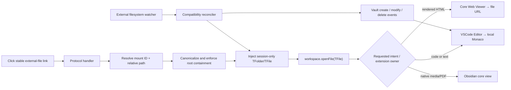

# External File Bridge — planned architecture

Status: architecture agreed; implementation has not started. This fork currently remains Folder Bridge 2.15.3 with its original `folderbridge` plugin ID.

## Decision

Build one small, standalone Obsidian plugin from the Folder Bridge virtual-filesystem core. It will make an external file temporarily look like a normal Obsidian `TFile`, then let Obsidian's existing view registry choose how to display it.

- Folder Bridge is the code donor for path mapping, adapter proxying, security checks, virtual file injection, and filesystem watching.
- [VSCode Editor](https://github.com/sunxvming/obsidian-vscode-editor) remains a separate plugin and supplies the locally bundled Monaco editor.
- Obsidian's core Web Viewer renders HTML when the link explicitly asks for rendered output.
- `link-for` creates stable links; `link-doctor` validates them and diagnoses the local environment. They remain CLI companions rather than renderer code inside the plugin.

The bridge is deliberately renderer-neutral. It must not contain a Python editor, Monaco, syntax grammars, or a second HTML renderer.

## What “temporary virtual mount” means

Three kinds of state stay separate:

| State | Lifetime | Location |
| --- | --- | --- |
| Mount registry | Persistent, per machine | Plugin settings: stable mount ID → approved local root |
| Virtual `TFolder`/`TFile` objects | Current Obsidian session, created on demand | Obsidian's in-memory vault tree under a reserved virtual namespace |
| File bytes | Permanent until the user changes them | Original external filesystem path only |

No copy, symlink, placeholder, or cache file is written inside the real vault. Opening a link injects only the requested file and its virtual parent chain. The injected objects can remain cached for the session so open tabs and workspace restore stay reliable; unloading the plugin or restarting Obsidian removes them and they are rehydrated from links as needed.

## Runtime flow



The handoff point is an ordinary `TFile`. That is what lets the bridge compose with VSCode Editor today and with another file-view plugin later without a bridge rewrite.

## Link contract

The durable address should be machine-portable:

```text
obsidian://external-file?mount=pyblocks&path=src%2Fexample.py&line=42&view=source
```

- `mount` is a stable human-readable ID, not an absolute path.
- `path` is relative to that mount and cannot escape it.
- `line` and a later `column` are optional navigation hints passed to a capable view.
- `view=source` requests the extension owner, normally VSCode Editor for code.
- `view=rendered` is explicit and is primarily for HTML through core Web Viewer.

For migration, the handler can accept the existing absolute `path=` form only after the canonical path falls under an approved mount. `link-for` should emit the mount-aware form; `link-doctor` should flag legacy absolute links and offer the replacement.

## Component boundaries

### External File Bridge fork

Owns:

- the `obsidian://external-file` protocol;
- mount ID resolution and device-local root mappings;
- canonical path containment and symlink-escape checks;
- read-only-by-default virtual adapter access;
- on-demand injection and session rehydration;
- watcher-to-vault event reconciliation;
- renderer availability diagnostics and graceful errors.

Does not own:

- code editing UI;
- language support or Monaco packaging;
- rendered HTML UI;
- whole-repository indexing by default;
- WebDAV, S3, SFTP, mobile support, or write-through editing in the first release.

### VSCode Editor plugin

Owns the local Monaco bundle, language mode, tabs, editing experience, and any line navigation it exposes. The bridge has a soft integration with it, not a hard bundled dependency: Obsidian's extension registration remains the source of truth.

### Core Web Viewer

Owns rendered local HTML. HTML source and rendered HTML are two explicit intents so one plugin cannot “take ownership” of every `.html` click. The bridge should never register its own HTML view.

### `link-for` and `link-doctor`

Share the mount-address model with the plugin:

- `link-for /absolute/file.py` finds the containing mount and emits the portable URI.
- `link-doctor` verifies parsing, mount availability, canonical containment, file existence, and the requested renderer.
- An environment check verifies that External File Bridge is enabled and reports whether VSCode Editor or core Web Viewer can satisfy the requested intent.

## Compatibility seam inherited from Folder Bridge

Folder Bridge replaces `vault.adapter` with a Proxy and injects `TFile`/`TFolder` objects into Obsidian's internal tree. That mechanism is the useful core, but it relies on private Obsidian behavior and must be isolated behind a small compatibility module.

The upstream watcher currently sends Chokidar events through private `vault.onChange(...)`. In an isolated Obsidian 1.13.7 test, Chokidar saw an external rewrite but the public `modify` event did not fire and the open Monaco view did not refresh. The fork will replace that path with a tested reconciler that:

1. updates or removes the injected object;
2. refreshes its stat/cache state;
3. emits the matching vault `create`, `modify`, or `delete` event;
4. proves the open Monaco tab refreshes in real Obsidian.

Private API use will be version-gated and fail closed with a useful notice. It should not be scattered through UI or protocol code.

## First implementation slice

The narrow tracer bullet is one read-only local file:

1. Rename the package and plugin ID to `external-file-bridge` while retaining the MIT license and fork history.
2. Keep only local desktop mounts and remove cloud/mobile/whole-tree features from the runtime boundary.
3. Add a stable mount registry and the `obsidian://external-file` handler.
4. Inject one requested path under a reserved session namespace and open it through `workspace.openFile`.
5. Prove `.py` opens in VSCode Editor/Monaco without a physical vault entry.
6. Rewrite the watcher reconciliation seam and prove a disk edit refreshes the open Monaco buffer.
7. Add explicit rendered-HTML routing through core Web Viewer.
8. Migrate `link-for` and `link-doctor`, then package a release installable through BRAT/manual release assets.

Write-through editing can follow only after read-only opening, refresh, path containment, unload cleanup, and workspace rehydration pass in the real app.

## Baseline evidence

Before any fork changes:

- `npm run validate` passes: lint, UI text, TypeScript/esbuild build, and 134 tests across 9 files.
- `npm audit --omit=dev` reports four inherited runtime findings (two high, two moderate) in the AWS/WebDAV XML/glob dependency trees. Those backends are outside the local-only first release and should be removed with their dependencies instead of patched into a runtime we do not intend to ship.
- An isolated Obsidian 1.13.7 instance loads the fork and VSCode Editor.
- `ExternalProject/hello.py` is backed by a file outside the vault, is represented as a `TFile`, and opens in a real `.monaco-editor` view.
- No test touched the live vault or live Obsidian window.

See the [interactive architecture summary](architecture.html) for the visual flow and current proof state.
