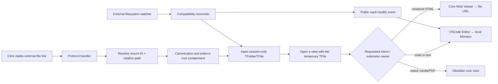

# External File Bridge — architecture

Status: the local-only read-only first slice is implemented as `external-file-bridge` 0.1.0 and verified in isolated Obsidian 1.13.7.

## Decision

Build one small, standalone Obsidian plugin from the Folder Bridge virtual-filesystem core. It will make an external file temporarily look like a normal Obsidian `TFile`, then let Obsidian's existing view registry choose how to display it.

- Folder Bridge is the code donor for path mapping, adapter proxying, security checks, virtual file injection, and filesystem watching.
- [VSCode Editor](https://github.com/sunxvming/obsidian-vscode-editor) remains a separate plugin and supplies the locally bundled Monaco editor.
- Obsidian's core Web Viewer renders HTML when the link explicitly asks for rendered output.
- `link-for` creates stable links; `link-doctor` validates them and diagnoses the local environment. They remain CLI companions rather than renderer code inside the plugin.

The bridge is deliberately renderer-neutral. It must not contain a Python editor, Monaco, syntax grammars, or a second HTML renderer.

## What “temporary virtual mount” means

Three kinds of state stay separate:

| State | Lifetime | Location |
| --- | --- | --- |
| Mount registry | Persistent, per machine | Plugin settings: stable mount ID → approved local root |
| Virtual `TFolder`/`TFile` objects | Current Obsidian session, created on demand | Obsidian's in-memory vault tree under a reserved virtual namespace |
| File bytes | Permanent until the user changes them | Original external filesystem path only |

No copy, symlink, placeholder, or cache file is written inside the real vault. Opening a link injects only the requested file and its virtual parent chain. The injected objects can remain cached for the session so open tabs and workspace restore stay reliable; unloading the plugin or restarting Obsidian removes them and they are rehydrated from links as needed.

## Runtime flow



The handoff point is an ordinary `TFile`. That is what lets the bridge compose with VSCode Editor today and with another file-view plugin later without a bridge rewrite.

## Link contract

The durable address should be machine-portable:

```text
obsidian://external-file?mount=pyblocks&path=src%2Fexample.py&line=42&view=source
```

- `mount` is a stable human-readable ID, not an absolute path.
- `path` is relative to that mount and cannot escape it.
- `line` is an optional navigation hint applied to Monaco after opening. `column` is reserved by the companion link format.
- `view=source` requests the extension owner, normally VSCode Editor for code.
- `view=rendered` is explicit and is primarily for HTML through core Web Viewer.

For migration, the handler can accept the existing absolute `path=` form only after the canonical path falls under an approved mount. `link-for` should emit the mount-aware form; `link-doctor` should flag legacy absolute links and offer the replacement.

## Component boundaries

### External File Bridge fork

Owns:

- the `obsidian://external-file` protocol;
- mount ID resolution and device-local root mappings;
- canonical path containment and symlink-escape checks;
- read-only-by-default virtual adapter access;
- on-demand injection and session rehydration;
- watcher-to-vault event reconciliation;
- renderer availability diagnostics and graceful errors.

Does not own:

- code editing UI;
- language support or Monaco packaging;
- rendered HTML UI;
- whole-repository indexing by default;
- WebDAV, S3, SFTP, mobile support, or write-through editing in the first release.

### VSCode Editor plugin

Owns the local Monaco bundle, language mode, tabs, editing experience, and any line navigation it exposes. The bridge has a soft integration with it, not a hard bundled dependency: Obsidian's extension registration remains the source of truth.

### Core Web Viewer

Owns rendered local HTML. HTML source and rendered HTML are two explicit intents so one plugin cannot “take ownership” of every `.html` click. The bridge should never register its own HTML view.

### `link-for` and `link-doctor`

Share the mount-address model with the plugin:

- `link-for /absolute/file.py` finds the containing mount and emits the portable URI.
- `link-doctor` verifies parsing, mount availability, canonical containment, file existence, navigation hints, and the requested renderer.
- An environment check verifies that External File Bridge is enabled and reports whether VSCode Editor or core Web Viewer can satisfy the requested intent.

## Compatibility seam inherited from Folder Bridge

Folder Bridge replaces `vault.adapter` with a Proxy and injects `TFile`/`TFolder` objects into Obsidian's internal tree. That mechanism is the useful core, but it relies on private Obsidian behavior and must be isolated behind a small compatibility module.

The upstream watcher sent Chokidar changes through private `vault.onChange(...)`. In an isolated Obsidian 1.13.7 spike, Chokidar saw an external rewrite but that path did not refresh the open Monaco buffer. The fork replaces it with a reconciler that:

1. updates or removes the injected object;
2. refreshes its stat/cache state;
3. emits Obsidian's public `modify` event for a changed `TFile` and uses private create/remove hooks only for the virtual tree lifecycle;
4. refreshes the open Monaco tab in real Obsidian.

Private API use will be version-gated and fail closed with a useful notice. It should not be scattered through UI or protocol code.

## Implemented first slice

The narrow tracer bullet is one read-only local file:

1. The package and plugin ID are `external-file-bridge`; MIT lineage and fork history are retained.
2. The bundled runtime contains only local desktop mounts and Chokidar. Cloud/mobile modules remain outside the production dependency tree.
3. Stable mount settings and the `obsidian://external-file` handler are active.
4. Only a requested file and its synthetic parent chain are injected under `_External/<mount-id>`.
5. Source intent explicitly selects VSCode Editor's view, sets Monaco read-only, and applies the requested line.
6. A per-file watcher refreshes an open Monaco buffer through the public `modify` event.
7. Rendered HTML routes through the core Web Viewer; HTML source remains available with `view=source`.
8. `link-for` emits mount-aware URIs and `link-doctor` diagnoses the full local composition.

Write-through editing remains intentionally out of scope. Read-only opening, refresh, path containment, unload cleanup, and restart rehydration now pass in the real app harness.

## Verification evidence

- `npm run validate` passes lint, UI text, TypeScript/esbuild build, and 141 tests across 11 files.
- `npm audit --omit=dev` reports zero production findings. The unused cloud dependencies are no longer in the shipped runtime tree.
- A real link click in isolated Obsidian 1.13.7 opens an external `.py` file in VSCode Editor's Monaco view at the requested line.
- Monaco is read-only, and no physical `_External` path exists inside the throwaway vault.
- Rewriting the original external file refreshes the open Monaco buffer.
- A rendered `.html` link opens the original `file://` URL in the core Web Viewer with its fragment.
- The live installation was checked without opening or focusing a live-vault file; both new plugins loaded and Obsidian captured no errors.

See the [implementation gallery](implementation-gallery.html) for the visual flow and proof screenshots.
